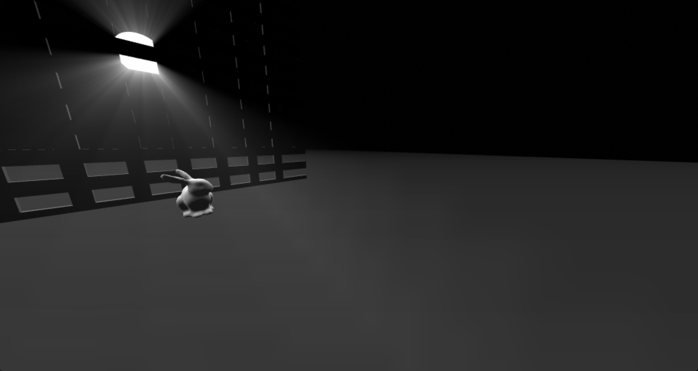

# glsl-godrays

This module implements the volumetric light scattering effect(godrays) described in
"Volumetric Light Scattering as a Post-Process" as a GLSL shader. A demo
is provided at: http://erkaman.github.io/glsl-godrays/

The camera in the demo is controlled as follows:

* Keys `W` and `S` are used to walk forward and backward.
* Keys `A` and `D` are used to stride left and right.
* Keys `O` and `L` are used to fly up and down.
* Hold down the key `M` to speed up the camera.
* Hold down the left mouse button and move the mouse to turn the camera.




[](https://www.npmjs.com/package/glsl-godrays)

## Rendering Setup

In order to implement the effect, no less than three rendering passes will have to be done:

1. Render all geometry that could occlude the light source as black. Normally render light source.
And render all the above to a texture called the "occlusion texture". Note that this texture
does not have to be exactly the size of the screen, but it can be smaller.
And by making it smaller, lots of performance can be gained.


2. Render everything normally, to the default framebuffer.


3.  Now enable alpha blending, because we will render the volumetric light rays in a fullscreen pass, and
     combine them with the scene rendered in pass 2 by simply using alpha blending. Also, as input to pass 3, is the "occlusion texture" that was rendered to in pass 1. This texture is used to
     ensure that unnatural streaks of light do not appear on objects that are occluding the light source.

For more details, please refer to the source code of the provided demo.

## Shader Usage

In the third pass, the godrays are rendered in a fullscreen pass, where every fragment
gets its color from the following function:

```
vec3 godrays(
    float density,
    float weight,
    float decay,
    float exposure,
    int numSamples,
    sampler2D occlusionTexture,
    vec2 screenSpaceLightPos,
    vec2 uv
    );
   ```

Where the parameters are

* `density` please refer to the article "Volumetric Light Scattering as a Post-Process" for a definition of this parameter.
* `weight` see the above.
* `decay` see the above.
* `exposure` see the above.
* `numSamples` see the above. However, note that the maximum value of this parameter is 100!
* `occlusionTexture` the "occlusion texture" created in pass 1.
* `screenSpaceLightPos` the light position in screen space. In the source code of the demo it is shown how this can be calculated.
* `uv` the coordinates of the current fragment. Note that `x` and `y` should both be in the interval
`[0,1]`, over the entire screen.